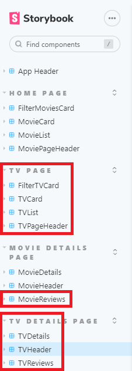
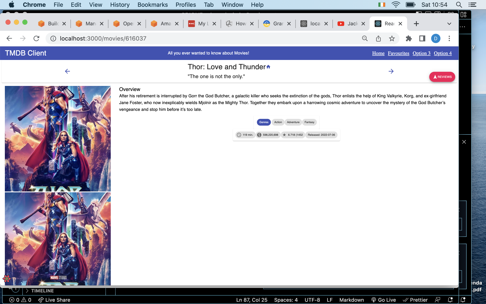
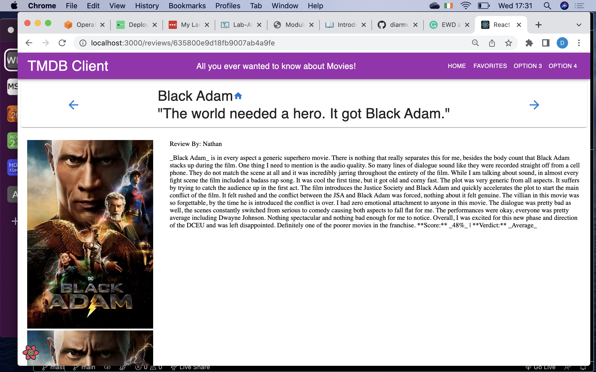

# Web App Dev 2 - Assignment 1 - ReactJS app.

Name: Jason Anca

## Overview.

### New Pages.

+ Top Rated Movies
+ Popular TV Shows
+ Favourite TV Shows
+ TV Show Details
+ Added Dark UI to Movie related Pages

e.g.

+ List of Trending movies.
+ (Modified) Movie Details page - added chips for .....
+ List of Actors.
+ etc

### New Features.

[ Provide a bullet-point list of the __new features__ you added to the Movies Fan app.] 
 
 e.g.

+ Added Dark UI to Movie related Pages
+ Add TV Shows to Favourites
+ Changed Icon colours

## Setup requirements.

+ None

## TMDB endpoints.

[ List the __additional__ TMDB endpoints used, giving the description and pathname for each one.] 

e.g.

+ /reviews/form         - Users reviews of a movie.
+ /reviewsTV/form       - Users reviews of a TV show.
+ /movies/favourites    - User's favourited movies.
+ /tv/favourites        - User's favourited TV shows.
+ /movies/:id           - Specific movie page
+ /                     - Homepage
+ /reviews/:id          - Page of a specific movie review
+ /reviewsTV/:id        - Page of a specific TV Show review
+ /movies/upcoming      - Page of upcoming movies
+ /tv/popularShows      - Page of popular TV Shows
+ /movies/popular       - Page of popular movies
+ /movies/toprated      - Page of top rated movies
+ /tv/:id               - Specific TV Show page

## App Design.

### Component catalogue.

### UI Design.

[ Insert screenshots of the __new app pages__ you developed (including modified existing pages), Have an appropriate caption for each one (see example below).

>Shows detailed information on a movie. Clicking the 'Reviews' floating action button will display extracts from critic reviews.

>Shows the full review for a movie.

### Routing.

+ /discover/movie       - Discover movies page
+ /movie/${id}          - Get the details of a specific movie
+ /genre/movie/list     - Get the list of genres for movies
+ /movie/${id}/reviews  - Get the reviews of a specific movie
+ /movie/${id}/images   - Get the poster of a specific movie
+ /movie/upcoming       - Get the upcoming movies
+ /movie/popular        - Get the popular movies
+ /movie/top_rated      - Get the top rated movies
+ /discover/tv          - Discover TV Shows
+ /tv/${id}             - Get the details of a specific TV Show
+ /genre/tv/list        - Get the list of genres for TV Shows
+ /tv/${id}/images      - Get the posters of a specific TV Shows
+ /tv/${tv_id}/reviews  - Get the reviews of a specific TV Shows
+ /tv/popular           - Get the Popular TV Shows

## Independent learning (If relevant).

[ Itemize the technologies/techniques you researched independently and adopted in your project, i.e. aspects not covered in the lectures/labs. Mention the source code filenames that illustrate these  (code excerpts are not required) and provide references to the online resources that helped you (articles/blogs).
